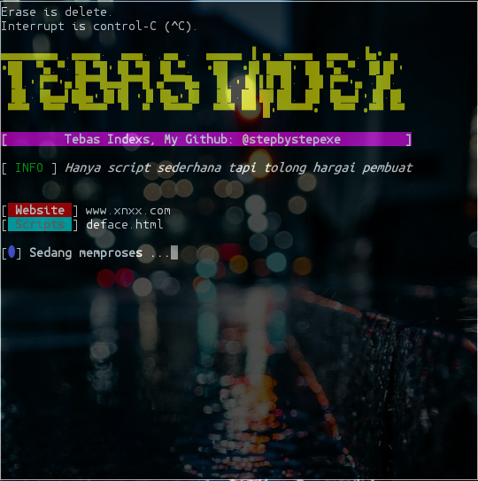

# Tbasindex:
**```Tebas index```** itu mengubah tampilan sebuah website sesuai pengertian Index itu sendiri ialah tampilan halaman utama website. Syarat utama tebas index harus upshell terlebih dahulu. Dan gunakan shell yang memadai.
#### Screenshot:

#### Cara Menginstall:
```
pkg update && pkg upgrade
apt-get install git
apt-get install bash
git clone https://github.com/stepbystepexe/Tebasindex
cd Tebasindex
ls
bash tebasindex.sh
```
#### Kontak:
+ Email d_q16x@outlook.co.id
+ WhatsApp https://tinyurl.com/wel4alo
#### Paypal:
+ Onclick https://bit.ly/3dcEQcN
#### LiberaPay:
<noscript><a href="https://liberapay.com/stepbystepexe/donate"></a></noscript>
>**Created by Nedi Senja**
